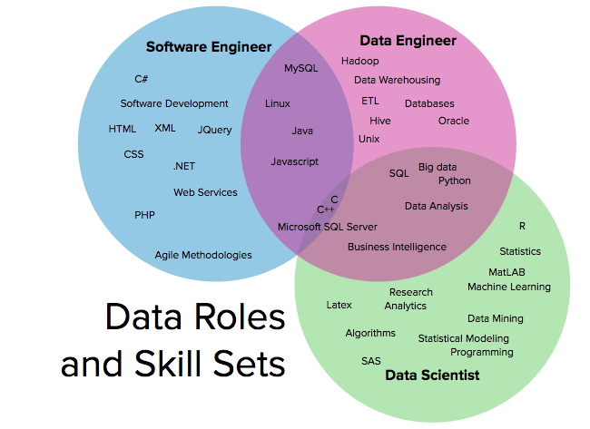

# Data Engineering

## Hierarchy of Needs

## Data roles and skill sets

## Data Engineering: A brief history

1) [On the Evolution of Data Engineering](https://medium.com/analytics-and-data/on-the-evolution-of-data-engineering-c5e56d273e37): This short read (~5 minutes) focuses on the recent change from managing SQL databases to working with massive datasets in real time. It was written by Julien Kervizic, an experienced analytics expert from the Netherlands.

2) [Data Engineering Introduction and Epochs](https://learn.panoply.io/hubfs/Data%20Engineering%20-%20Introduction%20and%20Epochs.pdf): This slightly longer read (~20 minutes) goes further back in time to the birth of computers. It walks through four "epochs" of data engineering, and the major advances over the past 70 years. It was written by Panopoly, a data engineering platform provider.

## Data Engineering Tools

-   <https://www.burtchworks.com/2018/09/10/the-rise-of-data-engineering-common-skills-and-tools/>
-   <https://www.analyticsindiamag.com/data-engineering-101-top-tools-and-framework-resources/>
-   <https://joviam.com/this-infographic-of-big-data-tools-will-blow-your-mind-infographic/>
-   <https://datafloq.com/big-data-open-source-tools/os-home/>