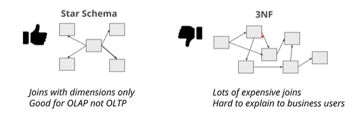

# Data Warehouse

- Operational perspective - Make it work!
- Business perspective - What is going on?

Definitions of a DWH
- a copy of transaction data specifically structured for query and analysis (KIMBALL)
- a **subject-oriented**, **integrated**, **nonvolatile* and **time-variant** collection of data in support of management's decisions (INMON)
- a system that retrives and consolidated data periodically from the source system into a dimensional or normalied data store. It is uually keeps years of history and is queried for business inteligence or other analytical activities. Is is typically updated in batches. (RAINARDI)

## Tech perspective

## Goals
- Simple to understand
- Performant
- Quality Assured
- Handles new questions well
- Secure

### Facts
- Numeric and Additive (99% cases)
    - Good: Comment counts, total amount for an invoice
    - Not good: invoice id, comment

### Dimensions
- Date & time
- Phisical locations
- Human roles
- Goods sold

## Operational db to Analytics

Naive ETL: From 3NF to ETL
- Query 3NF DB (Extract)
    - Join tables toghether
    - Change types
    - add new columns
- Loading
    - Insert into dfacts & dimension tables

Example [Sakila DB](https://www.jooq.org/sakila)

From

To

