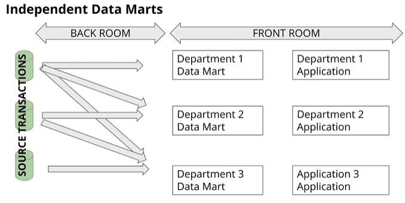

# Architectures
- Kinmball's Bus Architecture
- Independent Data Marts
- Inmon's Corporate Information Factory (CIF)
-Hybrid Bus & CIF

## Kimball's Bus Architecture

Source -> Back Room (ETL, hidden to end user, Kitchen rom) -> Front Room (Dining room)

**Front room**
- Dimensional
- Atomic & summary data - a number that cannot be divided, also has aggregations
- Organized by business process - each department would know where to go
- Uses conformed dimensions - eg. date dimension used in all organization
- Easy to use

### Kimbal matrix

Here Date dimension is all over the organization

### ETL 
- Extracting
    - Get the data from its source
    - Posibly delete old state (move)
- Transforming
    - Integrates many sources together
    - Possibly cleansing: inconsistencies, duplication, missing values
    - Possibly producing diagnostic metadata
- Loading
    - Structuring and loading the data into the dimensional data model

## Independent Data Marts

- in the Backroom each department does its ETL
- the dimensional models will be different
- it happens in reality - each department does what they want - autonomy can be faster
- not really recomanded

## Inmon's Corporate Information Factory (CIF)

- a 3NF copy in an Enterprise data warehouse, clean, in a safe architecture
- multiple datamarts using the same source
- the application layer can take the data from the data marts or the normalized enterprise data

- 2ETL Processes
    - Source systems -> 3NF DB
    - 3NF DB -> Departmental Data Marts
- The 3NF DB acts like an enterprise wide data store
    - Single integrated source of truth for data-marts
    - Could be accessed by end-users if needed
- Data marts dimensionally modelled & they are **mostly aggregated**
    - if you need the original data you can go back to the 3ND DB

## Hybrid Kimball Bus & Inmon CIF

- Combine the best of both

