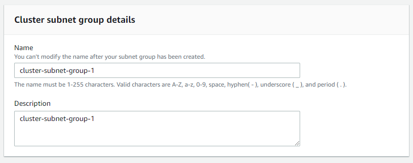
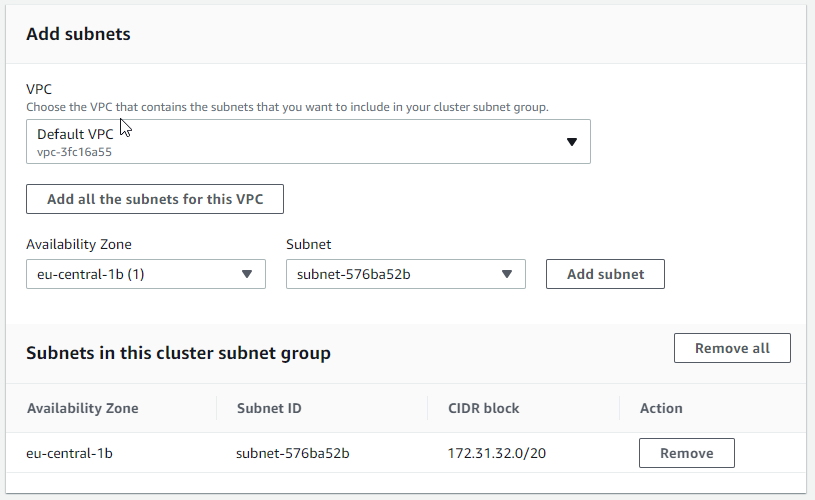

Create Security Group
=====================

Here, you'll create a security group you will later use to authorize access to your Redshift cluster.

1.  Go to your [Amazon EC2 console](https://console.aws.amazon.com/ec2) and under Network and Security in the left navigation pane, select Security Groups.
2.  Choose the Create Security Group button.

1.  Enter `redshift_security_group` for Security group name.
2.  Enter "authorize redshift cluster access" for Description.
3.  Select the Inbound tab under Security group rules.
4.  Click on Add Rule and enter the following values:

    -   Type: Custom TCP Rule.
    -   Protocol: TCP.
    -   Port Range: `5439`. The default port for Amazon Redshift is 5439, but your port might be different. See note on determining your firewall rules on the earlier "AWS Setup Instructions" page in this lesson.
    -   Source: select Custom IP, then type 0.0.0.0/0.

    Important: Using 0.0.0.0/0 is not recommended for anything other than demonstration purposes because it allows access from any computer on the internet. In a real environment, you would create inbound rules based on your own network settings.

5.  Choose Create.

Create Subnet Group
===================

## New interface

To create a cluster subnet group

1.  Sign in to the AWS Management Console and open the Amazon Redshift console at <https://console.aws.amazon.com/redshift/>.

2.  On the navigation menu, choose CONFIG, then choose Subnet groups. The list of subnet groups is displayed.

3.  Choose Create cluster subnet group to display the create page.

4.  Enter information for the subnet group, including which subnets to add.

5.  Choose Create cluster subnet group to create the group with the subnets that you chose.