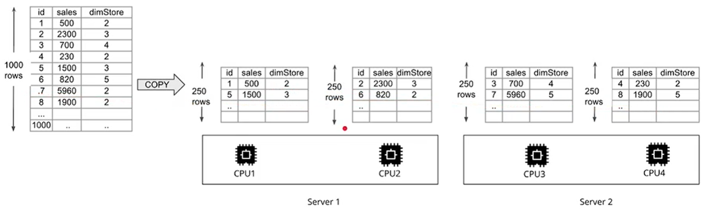
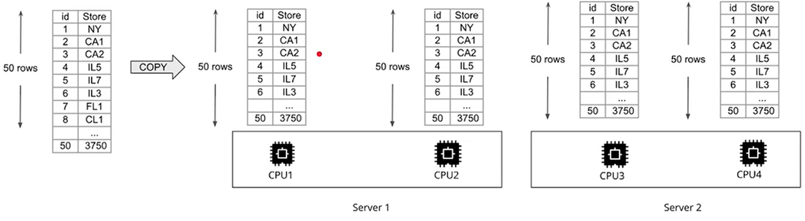

# Optimizing table design

- when a table is partitioned up into many pieces and distributed across slices in different machines, this is done blindly
- if one has an idea about the frequent access pattern of a table, one cand choose a more clever strategy
- possible strategies:
    - distribution style
    - sorting key


## Distribution styles
```
column type not null distkey,

diststyle all|even;
```
- EVEN
    - round-robin over all slices
    - good if a table won't be joined
    - 
    - High Cost of Joining because the keys are shuffeled
- ALL
    - for small tables
    - frequently used for dimensions tables
    - AKA "broadcasting"
    - 
- AUTO
    - Redshift decides
    - small enough tables are distributed with an ALL strategy
    - large tables are distrebuted with EVEN

## Sorting Keys
```
column type not null sortkey,
```
- can define column as sort key
- upoan loading, rows are sorted before distribution to slices
- minimize query time
- usefull for columns that are used frequently in sorting (date)
