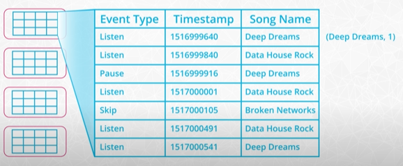
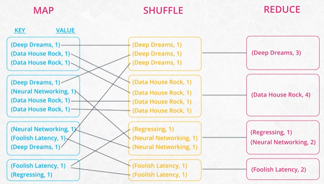

# Spark

Currently the most popular tool for big data analytics.

## Big data
- when you need to user more than one machine
- the numbers everyone should know
    - CPU - operation time - 0.4ns
    - Memory - random read - 100ns
    - Storage - random read on SSD - 16 us
    - Network - data round trip EU to US - 150ms
- CPU speed example
    - 2.5 GHz -> 2.5 billion operations per second
    - the catch: most of the time the CPU waits from data from RAM
- RAM ~250 times slower when random
    - store data sequentially to bypass waiting time
    - efficient for feeding data to CPU
    - ephemeral - data is lost on shutdown
    - expensive
    - Google approach (90's) distributed commodity hardware
- Storage
    - much slower than RAM
        - SSD 50 times
        - HDD 250 times
- Network
    - the most common bottleneck for big data
    - distributed systems try to minimize Shuffling data

CPU 200x -> RAM 15x -> SSD 20x -> Network

*Small Data*
- data that fits on one machine
- Example Sparkify 4GB music play log - get most popular Canadian Artist
- distributing the data is useless and will take more if coworkers are not available or delayed

*Big Data*
- after an year Sparkify db has grown to 200GB
- Steps
    - CPU processes the first batch and returns results to RAM
    - next data has to be loaded from SSD to RAM coordinated by the CPU
    - CPU has to handle a lot of data moving - Thrashing
    - system goes into a paralysis
- a good idea is to distribute the data
    - split the data and send it over the network
    - coworkers will process it for you and send it back

*Medium Data*
- results from previous task - 10GB of music logs from Canada
- need to sort the artists
- split the data locally and sort in two batches (a-m, n-z)
- merge the small results
- data is bigger than current machine can handle is not necessarily big data

*Parallel computing*: a first form of distributed computing
- multiple CPUs using a shared memory

## Hadoop Ecosystem
- fairly complex
- founded in 2006 base on a Google research

## Hadoop Framework
- HDFS - Data storage 
    - on commodity machines
    - provide very wide bandwidth 
- MapReduce - programming model for large scale data processing
- YARN - resource manager - schedules the computational applications
- Hadoop Common - utilities

Other
- Apache Pig - run SQL for Map Reduce jobs
- Apache Hive - another SQL-like interface on top on Map Reduce
- both tools are pretty slow because after each step the results are written to disk

*Spark*
- started at UC Berkeley in 2009
- doesn't have to write intermediate results to disk
- can perform fast memory computations for multiple Map and Reduce steps
- Open Sourced in 2010
- Became top level Apache project in 2014
- Storm and Flink
    - other distributed data projects, but designed for streaming
    - better than Spark Streaming

## MapReduce example
- HDFS will partition(chunks) our 200 GB data
- MAP step
    - load data from HDFS to each our node
    - transform data
        - read each line
        - check event is of type "Listen"
        - check the timestamp is in the query range
        - extract the name of the song
        - create a tuple: (song_name, 1)
    - need many Map processes

- Shuffle
    - all the pairs from the results files are shuffled through the cluster
    - all (song_name, 1) end up on the same node
- Reduce
    - a node combine all values for a single key
    - the (song_name, count) are written to the output files

## Spark modes
- Local mode
- Cluster modes
    - Standalone 
        - Cluster Manager
        - Driver
        - Executor
    - YARN
    - Mesos
- Use cases

## Spark use cases
- ETL
- Train ML models
- Uses all distributed computation techniques with better use of memory

